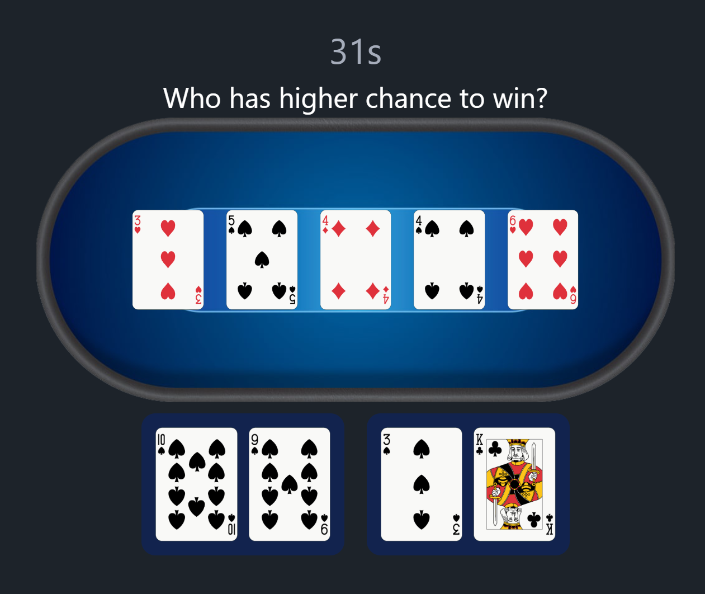
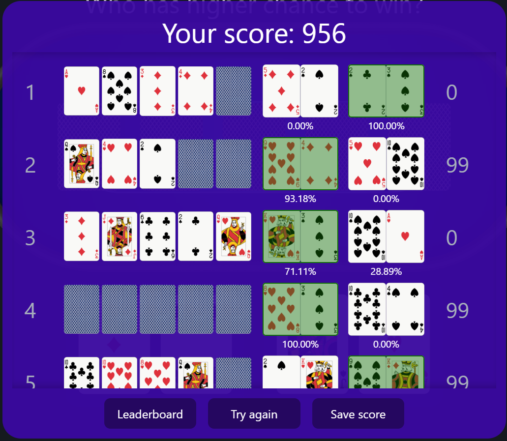
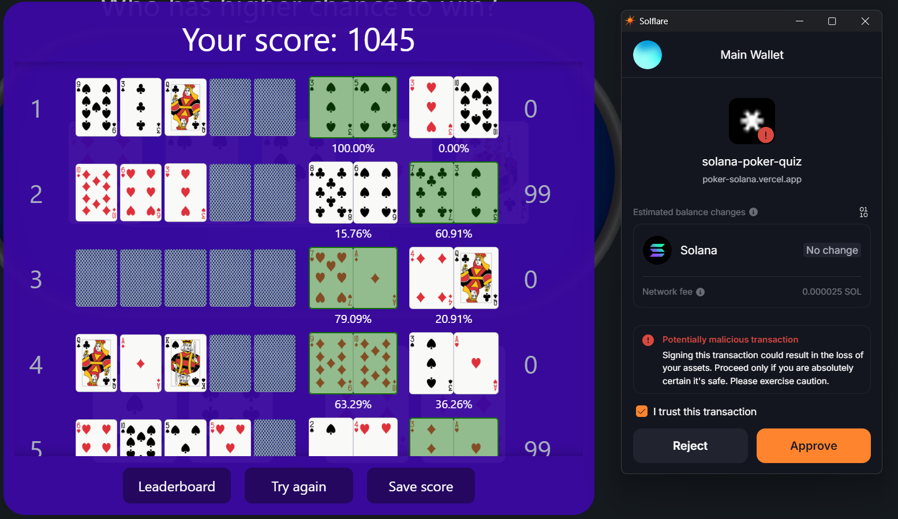

# solana-poker-quiz

This project is generated with the [create-solana-dapp](https://github.com/solana-developers/create-solana-dapp) generator.

## Getting Started

This project is a blockchain-based Texas Holdem Poker Quiz that challenges users to choose between two poker hands and determine which one has a higher chance of winning. The game quiz covers different stages of a poker round: preflop, flop, turn, and river, allowing users to analyze the odds and make decisions based on each stage. User score and address are saved on the Solana blockchain. 

PokSol is a first of its kind on-chain experience for all recreational and professional enjoyers of the game of Hold-Em Poker.

Following the path of classical poker communities like PokerStars and GGPoker we want to become the GO TO place for everything poker - with an on-chain twist on Solana. By incentivizing users with tokens and other rewards we want to create both an educational and professional platform for all types of players.

PokSol features a play-to-earn model. Each week, players compete by answering quiz questions and selecting the poker hand with the highest chance of winning. Your performance is reflected on the leaderboard, and the top player each week will receive free tokens as a reward!





After result is saved to blockchain:



### Prerequisites

- Node v18.18.0 or higher

- Rust v1.77.2 or higher
- Anchor CLI 0.30.1 or higher
- Solana CLI 1.18.17 or higher

### Installation

#### Clone the repo

```shell
git clone <repo-url>
cd <repo-name>
```

#### Install Dependencies

```shell
npm install
```

#### Start the web app

```
npm run dev
```

## Apps

### anchor

This is a Solana program written in Rust using the Anchor framework.

#### Commands

You can use any normal anchor commands. Either move to the `anchor` directory and run the `anchor` command or prefix the command with `npm run`, eg: `npm run anchor`.

#### Sync the program id:

Running this command will create a new keypair in the `anchor/target/deploy` directory and save the address to the Anchor config file and update the `declare_id!` macro in the `./src/lib.rs` file of the program.

You will manually need to update the constant in `anchor/lib/counter-exports.ts` to match the new program id.

```shell
npm run anchor keys sync
```

#### Build the program:

```shell
npm run anchor-build
```

#### Start the test validator with the program deployed:

```shell
npm run anchor-localnet
```

#### Run the tests

```shell
npm run anchor-test
```

#### Deploy to Devnet

```shell
npm run anchor deploy --provider.cluster devnet
```

### web

This is a React app that uses the Anchor generated client to interact with the Solana program.

#### Commands

Start the web app

```shell
npm run dev
```

Build the web app

```shell
npm run build
```
